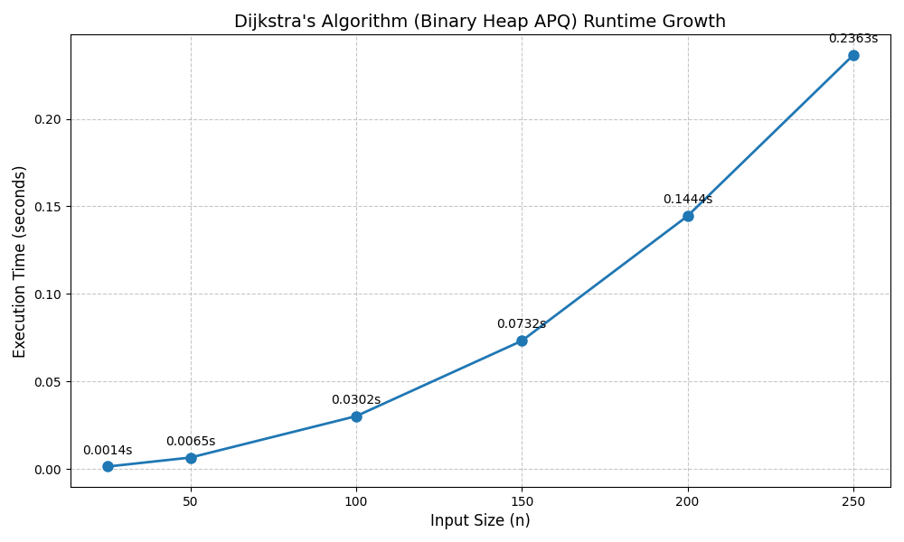
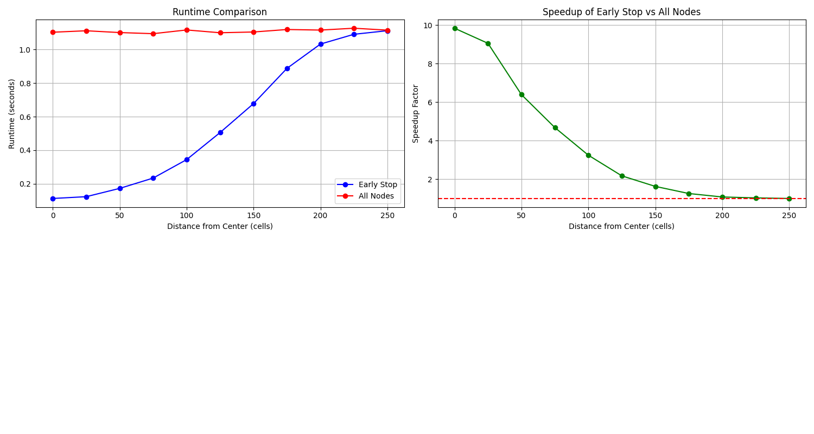
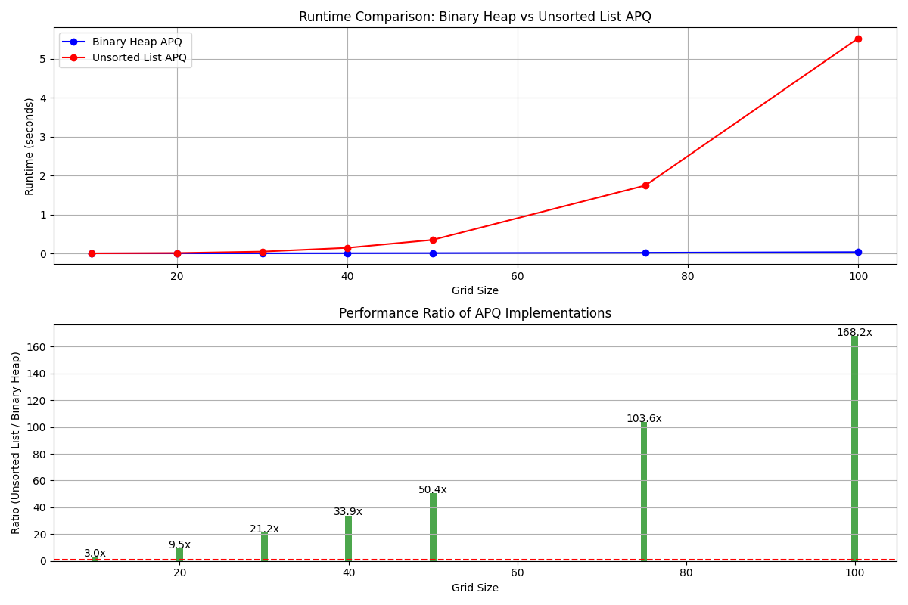
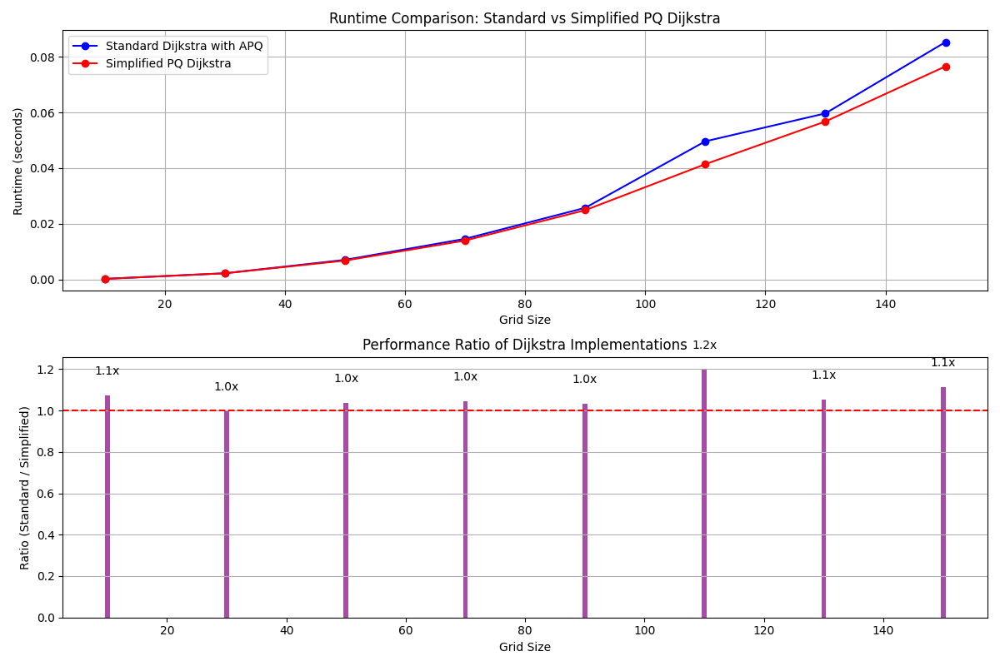

# Dijkstra's Algorithm Variants: Performance Analysis

## Introduction

This report is part of the formal assessment for CS2516. The aim is to evaluate
different variants of Dijkstra's algorithm for finding the shortest path in
undirected weighted graphs.

## Implementation Details

### Graph Implementation

The graph is implemented using an adjacency map approach, where each vertex is a
key in a map, and its value is another map mapping adjacent vertices to the
edges connecting them.

```python
class Graph:
    def __init__(self) -> None:
        self.graph: dict[Vertex, dict[Vertex, Edge]] = {}
```

### Priority Queue Implementations

Three priority queue implementations were created:

1. **Binary Heap Adaptable PQ**: Uses Python's heapq module with a lazy deletion
   (having a REMOVED boolean for each item in the q) approach, providing O(log
   n) operations. Implementation was inspired by
   <https://docs.python.org/3/library/heapq.html>
2. **Unsorted List Adaptable PQ**: Linear time complexity implementation with
   O(n) operations.
3. **SimplePQ**: Non-adaptable priority queue that allows multiple entries for
   the same vertex.

### Dijkstra's Algorithm Variants

Three variants of Dijkstra's algorithm were implemented:

1. **Standard Dijkstra**: Uses binary heap adaptable PQ with updates to existing
   vertices.
2. **Dijkstra with Unsorted List APQ**
3. **Dijkstra with Simple PQ**

## Q1: Implementing Dijkstra's Algorithm on Simple Weighted Graphs

The implementation successfully finds the shortest paths on the test graphs:

- **simplegraph1**: The shortest path from V1 to V4 has length 8, with preceding
  vertex v3.
- **simplegraph2**: The shortest path from 14 to 5 has length 16, with preceding
  vertex 8.

Tests can be run using the make targets provided.

```bash
make test1 #simplegraph1
make test2 #simplegraph2
```

## Q2: Generating Random Graphs

Random graphs are generated as grid graphs where each node corresponds to an
entry in an n×m grid. Edges connect adjacent nodes with random weights in the
range [1, max(n,m)//2].

```python
def generate_random_graph(self, n: int, m: int) -> list[list[Vertex]]:
    # Create vertices
    node_matrix = [[None for _ in range(m)] for _ in range(n)]
    for i in range(n):
        for j in range(m):
            v = Vertex(f"v{i}_{j}")
            node_matrix[i][j] = v
            self.graph[v] = {}

    # Create edges with random weights
    for i in range(n):
        for j in range(m):
            if i + 1 < n:  # Add edge to node below
                self.add_edge(
                    node_matrix[i][j],
                    node_matrix[i + 1][j],
                    random.randint(1, max(n, m) // 2),
                )
            if j + 1 < m:  # Add edge to node to the right
                self.add_edge(
                    node_matrix[i][j],
                    node_matrix[i][j + 1],
                    random.randint(1, max(n, m) // 2),
                )
    return node_matrix
```

Code can also be found under <./xcollections/graph.py>

## Q3: Runtime Analysis of Dijkstra as Graph Size Increases

We evaluated the runtime of Dijkstra's algorithm (with binary heap APQ) as the
graph size increases. Each test ran on multiple random graph instances of the
same size to obtain reliable average runtimes.



### Analysis

The results show that Dijkstra's runtime expectedly increases as the graph size
grows. The theoretical complexity is O(E log V), where E is the number of edges
and V is the number of vertices. In a grid graph nxn, E ≈ 2V (each node has at
most 4 edges), so the runtime complexity is approximately O(V log V). The plot
shown confirms this growth pattern.

## Q4: Early-Stop vs. Full Dijkstra Analysis

We compared two versions of Dijkstra's algorithm:

1. **Early-Stop**: Stops when the destination vertex is removed from the queue
2. **All-Nodes**: Computes shortest paths to all vertices and then traces the
   path.



### Analysis

The results show that early-stop provides performance benefits when the source
and destination are relatively close. As the distance between the source and the
destination increases, the speedup decreases since more of the graph needs to be
explored anyway. The crossover point, where both approaches have similar
performance, will be reached when the destination is so far from the source that
most of the graph needs to be explored anyway.

In our tests on a 500×500 grid, the early-stop version consistently outperformed
the all-nodes version, with the speedup ranging from approximately 10x for
nearby nodes to 1x (no speedup what so ever) for the most distant nodes.

## Q5: Binary Heap vs. Unsorted List APQ

We compared the performance of Dijkstra's algorithm using two APQ
implementations: binary heap and an unsorted list.



### Analysis

The binary heap implementation outperforms the unsorted list. Especially as the
graph size increases. This is expected due to their theoretical complexity:

- Binary Heap APQ: O(V log V + E log V) ≈ O(V log V) for grid graphs
- Unsorted List APQ: O(V² + E) ≈ O(V²) for grid graphs

The performance gap expectedly widens with larger graphs, showing the
performance benefits of logarithmic time complexity operations.

## Q6: Evaluating a Simpler Priority Queue

Implemented a simplified version of Dijkstra's algorithm that uses a
non-adaptable priority queue, allowing multiple entries for the same vertex.



### Analysis

The Simplified PQ implementation performs equally well compared to the APQ
implementation. This could suggest that the overhead of checking and updating
existing entries in the standard approach can sometimes outweigh the benefit of
having fewer total entries in the queue.

## Conclusion

Key findings/insights:

1. The binary heap implementation of APQ significantly outperforms the unsorted
   list implementation, especially for larger graphs.
2. The early-stop optimization provides substantial speedups when the
   destination is relatively close to the source.
3. The simplified PQ approach, despite potentially adding more elements to the
   queue, is competitive with the standard implementation due to reduced
   overhead.

